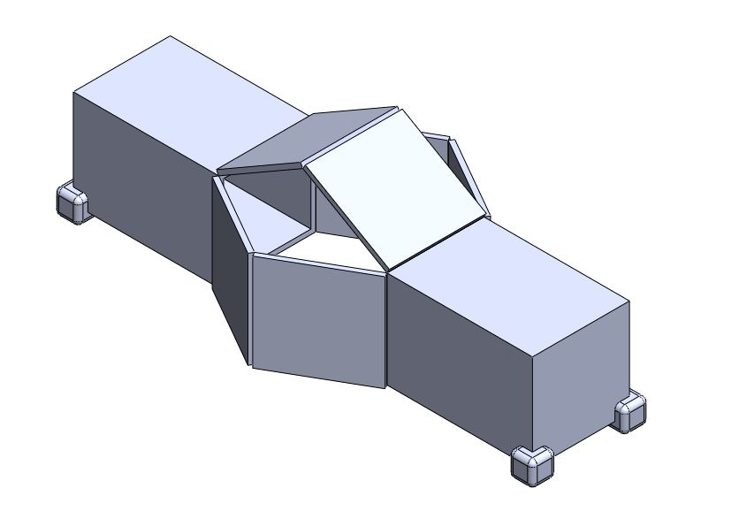
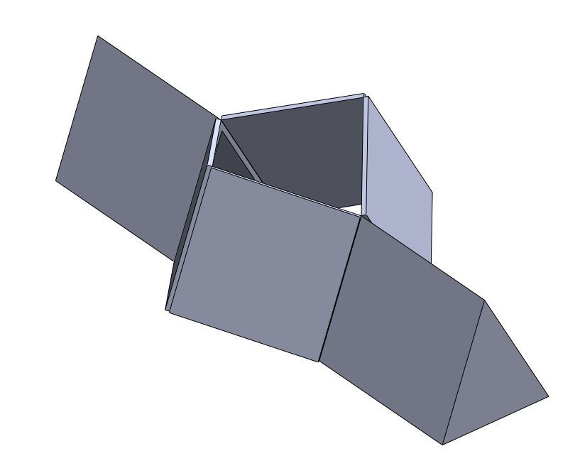
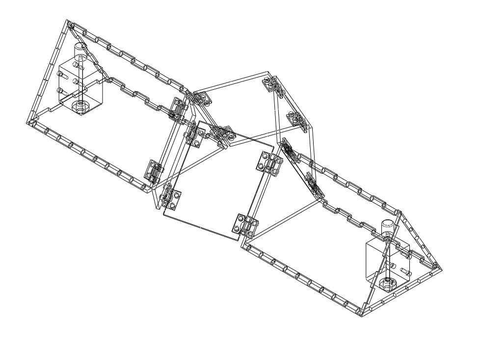
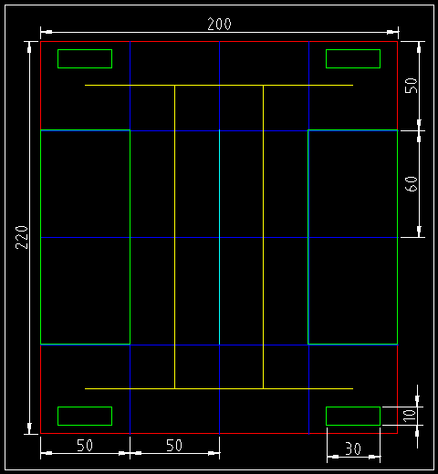
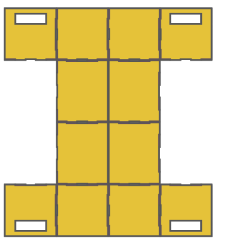
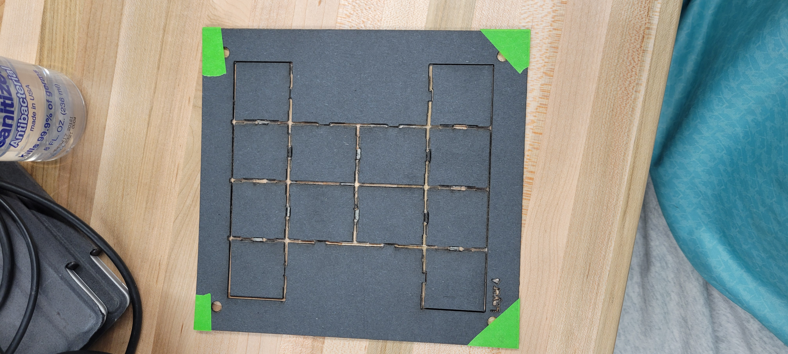
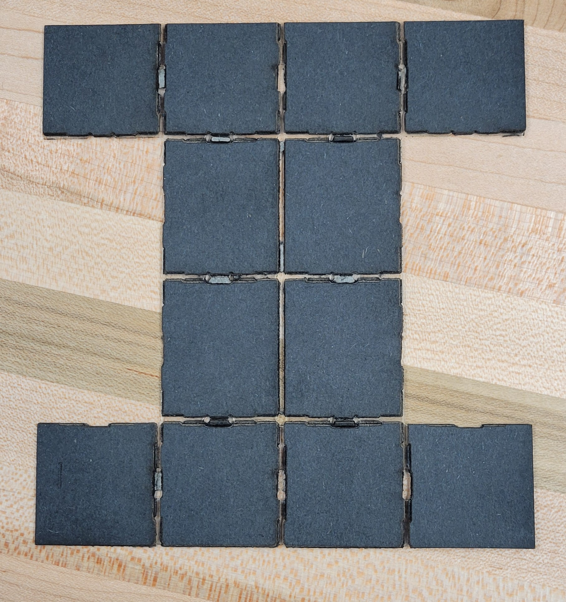

Pre Design Concepts
======
Before beginning any mechanical design work, we studied how inchworms generate motion and how previous robots have abstracted that gait into linkage based mechanisms. The three reference images (Inchworm Design 1–3) guided this explanation.

1.Biological Gait Analysis
The first image (Inchworm1) shows the natural inchworm motion cycle:

* The rear end anchors

* The body arches upward

* The front end extends forward and anchors

* The rear releases and follows

*Figure 1. Kinematic model of an inchworm inspired linkage mechanism. The diagram illustrates how extension and contraction are generated through a series of rigid links defined by lengths a, b, y, and z. As the central joint rotates between θ_max and θ_min, the upper triangular section lifts and repositions the body. The rear anchor remains fixed while the front segment advances, producing a net forward displacement l per cycle. This simplified model highlights the geometric relationships that govern stride length and the range of motion achievable in inchworm style locomotion.*

This sequence highlighted two key principles we needed to replicate mechanically: alternating anchoring and body arching that converts vertical motion into forward displacement.

2.Robotic Gait Diagrams and Joint Behavior
The second image (Inchworm2) presents a simplified kinematic interpretation of this gait. It shows how a small number of joints can recreate the arch extend reset pattern through controlled rotation. The diagram specifically illustrates:

* How angles between segments open and close during the stride

* How one end remains fixed while the other swings forward

* How joint states (free vs. locked) determine which segment acts as the anchor

*Figure 2. Transition between minimum angle and mid-swing configurations in the inchworm linkage. The solid lines represent the mechanism in its fully contracted state, defined by the minimum joint angle θ_min. As the central joint opens, the linkage follows the dashed trajectory, lifting the body and advancing the free end forward. This diagram highlights how rotation at a single joint produces both vertical elevation and horizontal displacement, enabling the inchworm style lift and drag gait.*

From this, we concluded that the mechanism could be reduced to a central folding joint and two end segments serving as controllable anchors.

3.Geometric Parameters and Link Length Relationships
The third image (Inchworm3) shows a parametric sketch of a linkage based inchworm mechanism, introducing variables such as link lengths, hinge angles, and stride geometry. This diagram made clear that:

* Stride length is directly determined by linkage geometry

* the maximum and minimum hinge angles define lift height and extension

* a triangular or folded shape naturally produces the required arching motion

*Figure 3. Biological inchworm gait compared with a mechanical linkage model. 
The left side shows the natural lift and drag motion of an inchworm as it anchors 
its rear end, arches upward, and moves the front end forward before contracting. 
The right side illustrates the equivalent mechanical sequence, where joints switch 
between active and inactive states and the front and rear anchors alternate between 
attached and released. Across stages t0 through t4, coordinated joint rotation 
produces lifting and forward motion, resulting in a net stride length.*
 

This confirmed that a triangular foldable structure with one actuated hinge could reproduce the biological gait while remaining easy to fabricate from sheet materials.

# V1 
Version 1 represented the team’s first attempt to translate the inchworm gait into a mechanical form. The purpose of this initial model was not to create a functional prototype, but rather to establish a shared understanding of scale, geometry, and intended motion before progressing into detailed design. V1 served as a communication tool, ensuring that all team members aligned on the overall structure and spatial requirements of the mechanism.

*Figure 4. Version 1 CAD concept of the inchworm mechanism. This early model was 
used to explore the overall shape, approximate size, and intended fold motion. 
The design included box shaped body segments and feet but was not 
intended for fabrication. Instead, it served as a communication and planning tool 
to visualize how the central panel would fold and how the mechanism might contract 
and extend during a gait cycle.*
 

Since V1 existed only as a digital assembly in SolidWorks, it did not include actuators or physical hinges. Instead, simple mate constraints were used to demonstrate the basic horizontal fold unfold motion envisioned for the mechanism. The model relied on mated edges rather than true joint definitions, reflecting its role as a conceptual layout rather than a manufacturable system.

The design incorporated box shaped end segments, chosen under the early assumption that rectangular volumes would simplify mounting internal components. Small pad like features were added at the corners of these boxes to act as placeholders for future high friction anchoring feet. At this stage, the intent was only to visualize the anchoring locations, not to engineer their mechanics.

The motion captured in V1 was intentionally simple: a single fold–unfold action at the center of the mechanism. However, this initial configuration exposed several important limitations. The team quickly recognized that using three moving flaps created unnecessary complexity and would complicate actuation and control. Additionally, concerns emerged regarding structural rigidity maintaining a stiff box structure using a five layer foldable material appeared challenging without resorting to full 3D printed components, which did not align with the project’s fabrication goals.

The key lesson from V1 was the need to simplify. The mechanism was larger than necessary, contained too many moving elements, and did not align well with the desired material constraints. Around this stage, the team began running early simulations, which confirmed that reducing the system to two primary hinges would create more predictable kinematics and eliminate unwanted nonlinearities in the motion. These insights directly guided the transition toward a more refined, compact, and mechanically efficient version of the design.

# V2

Version 2 marked the team’s transition into the new triangular architecture that would ultimately define the mechanism’s kinematics. The purpose of this iteration was to move away from the box based geometry of V1 and adopt the symmetric triangular form that more accurately represented the desired arching behavior. This shift was necessary to establish a stable baseline for upcoming MuJoCo simulations and to validate the simplified motion pathway envisioned for the mechanism.

*Figure 5. Version 2 simplified linkage model. This design introduced the triangular 
folding geometry and reduced moving parts, allowing the team to validate the basic 
inchworm style fold and unfold behavior.*
 

The most significant change in V2 was the replacement of rectangular body segments with equal sided triangular panels. This geometry eliminated the bulkiness of the V1 design and created a cleaner, more consistent fold pattern. The team also removed the placeholder feet at this stage, choosing to focus solely on refining the body geometry before reintroducing anchoring features in later versions.

Within SolidWorks, V2 was used to verify that the fold unfold motion remained similar to that of V1 despite the change in structure. The design successfully maintained the intended motion profile, demonstrating that the simplified two flap configuration could produce the same basic kinematic behavior with fewer moving parts. This reduction aligned with the team’s goal of improving reliability fewer joints reduce mechanical failure modes and simplify control.

No major issues were identified during the development of V2. Instead, this version served as an effective stepping stone, confirming that the triangular layout was compatible with the desired motion and would be suitable for more advanced modeling. With these results, the team was able to proceed confidently toward V3, where more detailed hinge mechanics, structural considerations, and actuation strategies would be incorporated.

# V3

Version 3 represented the team’s first attempt to transition from conceptual geometry into a fully manufacturable mechanism. Whereas Versions 1 and 2 focused on defining overall form and simplifying kinematic behavior, V3 aimed to introduce realistic hardware, establish structural frameworks suitable for fabrication, and explore mounting strategies for future actuation. This iteration served as the bridge between digital sketching and practical engineering considerations.

*Figure 6. Version 3 CAD assembly incorporating real hinge hardware and structural 
features. This iteration introduced 3D printed hinge brackets, tab and slot panel 
construction, and mounting geometry for potential actuators. V3 served as the 
first manufacturable design and was used to evaluate rigidity, hinge clearance, 
and mechanical behavior before transitioning to the laminated foldable prototype.*
 

The most significant change in V3 was the introduction of real hinge hardware in place of the virtual mates used in earlier versions. The mechanism adopted a tab and slot panel design, reinforced with perimeter ribs to improve stiffness and better approximate the behavior of the final folded structure. The team also incorporated early motor mount geometries and began evaluating how solenoid actuators might integrate into the overall architecture. These additions required a more detailed internal framework and clearer definition of panel connections.

V3 was designed around fabrication methods that had not been considered in previous versions. The team explored laser cut wooden panels, combined with 3D printed hinge components secured by bolts and nuts. Although this version remained digital, it was modeled as if it were to be physically assembled, ensuring that real tolerances, material thicknesses, and hardware constraints were incorporated into the geometry.

Functionally, V3 attempted to improve several mechanical characteristics:

* More controlled and predictable hinge rotation

* Increased structural rigidity under load

* Dedicated interior volume for electronics

* Refined anchor foot integration

* Improved symmetry during the fold unfold motion

*Figure 7. Wireframe view of the Version 3 mechanical assembly. This model shows 
the full hinge network, 3D printed brackets, and internal mounting structures that 
were explored during this iteration. The wireframe visualization was used to study 
clearances, hinge motion paths, and potential interference between structural members 
before committing to fabrication. V3 provided the detailed mechanical groundwork that 
informed the simplified laminated design used in the final prototype.* 

These goals required significantly more detail than in prior versions, and the resulting model exposed several important limitations. The added hardware substantially increased the estimated system weight, contradicting the simplicity desired for a foldable, lightweight prototype. The number of hinge components led to unexpected assembly complexity, and several clearance and interference issues emerged once real geometry was introduced. These observations prompted the team to reconsider the direction of the design.

The key lesson from V3 was the importance of maintaining scope. The team recognized that the design had drifted toward unnecessary complexity introducing heavy materials, multiple hinges, and solenoid actuators before they were truly needed. This led to the decision to return to the five layer foldable material system used in class and to refocus on simplicity, weight reduction, and manufacturability. The insights gained in V3 directly shaped the more streamlined approach taken in subsequent iterations.

# V4/Final

Version 4 represented the team’s first fully functional physical prototype and served as the culmination of all prior design iterations. The primary objectives of this version were to validate the finalized hinge pattern, integrate real actuation hardware, and demonstrate a complete servo driven inchworm gait using a foldable structure. Unlike previous digital only models, V4 embodied the final architectural choices and provided the first opportunity to evaluate the mechanism under realistic operating conditions.

*Figure 8. LibreCAD layout of the foldable inchworm mechanism. This file defines 
the complete 2D cut pattern used for fabrication, including outer contours, hinge 
lines, and servo mounting slots. Color coded layers distinguish cut depths and 
fold types, allowing the laser cutter to produce accurate mountain folds, valley 
folds, and through cuts. The annotated dimensions were used to verify the overall 
footprint and ensure alignment across all five laminate layers.*

*Figure 9. Final fold pattern used for the five layer laminated inchworm body. 
The diagram identifies the cut lines, mountain folds, and valley folds required 
to create the triangular cross section and hinged center joint. Servo mounting 
slots are included at both ends to support front and rear anchoring actuators. 
This pattern served as the master template for all laser cut laminate layers.*

A major improvement in V4 was the return to the five layer laminated foldable material, which had proven reliable during classroom exercises and offered the appropriate combination of stiffness, durability, and hinge compliance. The design was manufactured using laser cut panels with pre defined hinge slots, resulting in a clean, lightweight structure that folded into the intended triangular mechanism. This approach also removed the excessive hardware weight seen in V3, yielding a more biomechanically plausible configuration.

V4 introduced full servo integration, replacing the heavier and more complex solenoid based concept previously explored. Three SG92R micro servos were embedded directly into the folding geometry: one for the central compression/retraction joint and two for front and rear anchoring actions. These were wired to an ESP32 microcontroller, allowing the team to implement and refine a synchronized control sequence for the gait cycle. The hinge layout and cut pattern translated effectively into real folding joints, forming the first version of the system with true mechanical compliance rather than simulated connections.

During testing, V4 successfully demonstrated several key behaviors:

* Reliable compression and extension of the body

* Functional actuation of the front and rear anchoring servos

* Coordinated electronic timing of the gait via ESP32 control

* Proof that the folded hinge pattern could carry load without collapsing

Although the prototype performed the expected motion, several limitations emerged. The lightweight servos struggled with torque demands and were not fully tuned, leading to inconsistent foot actuation and occasional alignment issues. The mechanism also experienced slipping on smooth surfaces, and the hinge folds occasionally collapsed inward if actuated too aggressively. Timing synchronization between servos required refinement, and the arcing motion inherent to servo rotation introduced inefficiencies during the lift phase.

The central takeaway from V4 was that, while the servo driven system achieved the correct overall motion direction and demonstrated a viable control architecture, rotary servos were not an ideal choice for producing vertical lifting forces at the hinges. A linear or non arcing actuator would likely improve lift efficiency and reduce mechanical interference. Nonetheless, V4 provided strong validation of the fold geometry, the five layer material approach, and the overall feasibility of achieving inchworm locomotion using a digitally fabricated hinge based body

# Fabrication Process

The fabrication of the final inchworm prototype followed a multi stage workflow designed to integrate foldable mechanism construction with embedded actuation hardware. The team employed the standard five layer laminate approach used in class, enabling the structure to behave as a lightweight but durable foldable linkage system.

*Figure 10. Annotated folding diagram showing cut lines, mountain folds, valley 
folds, and glue tab locations. Sections labeled A and B indicate panel groups 
that fold together during assembly. This template provided guidance for creating 
the correct hinge behavior in the laminate and ensured consistent construction 
across prototypes.*

## Material Stack Preparation

Each mechanism was constructed from a five layer composite stack consisting of:

* Outer cardstock layer

* Glue layer

* Hinge plastic film (flexible layer enabling repeated folding)

* Glue layer

* Inner cardstock layer

This configuration provided a balance between rigidity in the panels and compliance at the hinge lines, ensuring that the mechanism would deform predictably under servo actuation.

## Laser Cutting Workflow

All fabrication steps were performed using a laser cutter in two primary passes:

1. Hinge Pattern Cutting

* The hinge lines were selectively cut so that only the cardstock layers were removed while the hinge plastic remained intact.

* This created the mountain and valley folds defined in the design specification.

* The hinge pattern was cut individually into each of the three sheet materials prior to lamination.

2. Final Outline Cutting

* After lamination, the completed sheet was returned to the cutter for a full depth pass that released the perimeter of the mechanism and created the final shape.

Registration holes in each sheet aligned with four fixture pins allowed precise layer stacking and minimized error in hinge positioning.

*Figure 11. Laser cutting process used to produce the hinge patterns for the laminated 
inchworm body. The machine performs shallow passes to score mountain and valley 
folds before cutting the full outline. Precise registration ensures that all five 
laminate layers align correctly during fabrication.*

## Lamination and Forming

Following the hinge pattern cuts, the five sheets were stacked onto alignment pins and pressed together.
The assembly was then placed into a heat press, activating the adhesive layers and bonding the stack into a single laminated sheet.
Once cooled, the laminate preserved the hinge film flexibility while forming rigid structural panels.

The fully laminated piece was then placed back into the laser cutter, where the outer contour and servo mount openings were cut cleanly through all layers.

*Figure 12. Lasercut hinge layer removed from the cutter bed. The scored mountain 
and valley fold lines are visible within the central grid, while the outer contour 
remains connected to the frame for easy handling. Alignment holes in the corners 
allow this sheet to be stacked precisely with the other laminate layers before 
pressing and final cutting.*

*Figure X. Fully separated laminated hinge sheet after laser cutting. The individual 
panels and living hinges are visible, forming the flat layout that will fold into 
the inchworm body. This stage verifies that all hinge kerfs cut cleanly through the 
cardstock layers while preserving the hinge film needed for flexible motion.*

## Mechanical Assembly

After the mechanism was removed from the sheet:

* The two overlapping square panels at the central joint were hot glued together, forming the primary rotation surface for the actuation servo.

* Remaining folds were manually creased along their mountain/valley lines to ensure smooth mechanical action.

* The body was shaped into its triangular cross-section consistent with earlier design iterations.

## Servo Integration

Three SG92R micro servos were installed:

1. Central compression/retraction servo

2. GPIO13 → Front foot servo

3. Rear anchoring servo

Each servo was hot glued into its designated cavity and oriented so that its horn directly actuated the nearest hinge panel.
This method prioritized weight reduction over structural permanence, allowing rapid iteration and adjustment during testing.

## Electronics and Control Wiring

The servos were connected to a breadboard mounted ESP32 microcontroller, following the wiring diagram developed for V4:

* GPIO13 → Front foot servo

* GPIO12 → Compression/retraction servo

* GPIO14 → Rear foot servo

* A shared 5V rail and ground line powered all actuators

This configuration enabled synchronized gait control, timing adjustments, and rapid debugging during prototype evaluation.
