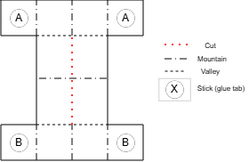

Pre Design Concepts
======
Before beginning any mechanical design work, we studied how inchworms generate motion and how previous robots have abstracted that gait into linkage based mechanisms. The three reference images (Inchworm Design 1–3) guided this explanation.

1.Biological Gait Analysis
The first image (Inchworm1) shows the natural inchworm motion cycle:

* The rear end anchors,

* The body arches upward,

* The front end extends forward and anchors,

* The rear releases and follows.

This sequence highlighted two key principles we needed to replicate mechanically: alternating anchoring and body arching that converts vertical motion into forward displacement.

2.Robotic Gait Diagrams and Joint Behavior
The second image (Inchworm2) presents a simplified kinematic interpretation of this gait. It shows how a small number of joints can recreate the arch extend reset pattern through controlled rotation. The diagram specifically illustrates:

* How angles between segments open and close during the stride,

* How one end remains fixed while the other swings forward,

* How joint states (free vs. locked) determine which segment acts as the anchor.

From this, we concluded that the mechanism could be reduced to a central folding joint and two end segments serving as controllable anchors.

3.Geometric Parameters and Link Length Relationships
The third image (Inchworm3) shows a parametric sketch of a linkage based inchworm mechanism, introducing variables such as link lengths, hinge angles, and stride geometry. This diagram made clear that:

* Stride length is directly determined by linkage geometry,

* the maximum and minimum hinge angles define lift height and extension,

* a triangular or folded shape naturally produces the required arching motion.

This confirmed that a triangular foldable structure with one actuated hinge could reproduce the biological gait while remaining easy to fabricate from sheet materials.

# V1
Version 1 represented the team’s first attempt to translate the inchworm gait into a mechanical form. The purpose of this initial model was not to create a functional prototype, but rather to establish a shared understanding of scale, geometry, and intended motion before progressing into detailed design. V1 served as a communication tool, ensuring that all team members aligned on the overall structure and spatial requirements of the mechanism.

Since V1 existed only as a digital assembly in SolidWorks, it did not include actuators or physical hinges. Instead, simple mate constraints were used to demonstrate the basic horizontal fold unfold motion envisioned for the mechanism. The model relied on mated edges rather than true joint definitions, reflecting its role as a conceptual layout rather than a manufacturable system.

The design incorporated box shaped end segments, chosen under the early assumption that rectangular volumes would simplify mounting internal components. Small pad like features were added at the corners of these boxes to act as placeholders for future high friction anchoring feet. At this stage, the intent was only to visualize the anchoring locations, not to engineer their mechanics.

The motion captured in V1 was intentionally simple: a single fold–unfold action at the center of the mechanism. However, this initial configuration exposed several important limitations. The team quickly recognized that using three moving flaps created unnecessary complexity and would complicate actuation and control. Additionally, concerns emerged regarding structural rigidity maintaining a stiff box structure using a five layer foldable material appeared challenging without resorting to full 3D printed components, which did not align with the project’s fabrication goals.

The key lesson from V1 was the need to simplify. The mechanism was larger than necessary, contained too many moving elements, and did not align well with the desired material constraints. Around this stage, the team began running early simulations, which confirmed that reducing the system to two primary hinges would create more predictable kinematics and eliminate unwanted nonlinearities in the motion. These insights directly guided the transition toward a more refined, compact, and mechanically efficient version of the design.

# V2

Version 2 marked the team’s transition into the new triangular architecture that would ultimately define the mechanism’s kinematics. The purpose of this iteration was to move away from the box based geometry of V1 and adopt the symmetric triangular form that more accurately represented the desired arching behavior. This shift was necessary to establish a stable baseline for upcoming MuJoCo simulations and to validate the simplified motion pathway envisioned for the mechanism.

The most significant change in V2 was the replacement of rectangular body segments with equal sided triangular panels. This geometry eliminated the bulkiness of the V1 design and created a cleaner, more consistent fold pattern. The team also removed the placeholder feet at this stage, choosing to focus solely on refining the body geometry before reintroducing anchoring features in later versions.

Within SolidWorks, V2 was used to verify that the fold unfold motion remained similar to that of V1 despite the change in structure. The design successfully maintained the intended motion profile, demonstrating that the simplified two flap configuration could produce the same basic kinematic behavior with fewer moving parts. This reduction aligned with the team’s goal of improving reliability fewer joints reduce mechanical failure modes and simplify control.

No major issues were identified during the development of V2. Instead, this version served as an effective stepping stone, confirming that the triangular layout was compatible with the desired motion and would be suitable for more advanced modeling. With these results, the team was able to proceed confidently toward V3, where more detailed hinge mechanics, structural considerations, and actuation strategies would be incorporated.

# V3

Version 3 represented the team’s first attempt to transition from conceptual geometry into a fully manufacturable mechanism. Whereas Versions 1 and 2 focused on defining overall form and simplifying kinematic behavior, V3 aimed to introduce realistic hardware, establish structural frameworks suitable for fabrication, and explore mounting strategies for future actuation. This iteration served as the bridge between digital sketching and practical engineering considerations.

The most significant change in V3 was the introduction of real hinge hardware in place of the virtual mates used in earlier versions. The mechanism adopted a tab and slot panel design, reinforced with perimeter ribs to improve stiffness and better approximate the behavior of the final folded structure. The team also incorporated early motor mount geometries and began evaluating how solenoid actuators might integrate into the overall architecture. These additions required a more detailed internal framework and clearer definition of panel connections.

V3 was designed around fabrication methods that had not been considered in previous versions. The team explored laser cut wooden panels, combined with 3D printed hinge components secured by bolts and nuts. Although this version remained digital, it was modeled as if it were to be physically assembled, ensuring that real tolerances, material thicknesses, and hardware constraints were incorporated into the geometry.

Functionally, V3 attempted to improve several mechanical characteristics:

* More controlled and predictable hinge rotation,

* Increased structural rigidity under load,

* Dedicated interior volume for electronics,

* Refined anchor foot integration, and

* Improved symmetry during the fold unfold motion.

These goals required significantly more detail than in prior versions, and the resulting model exposed several important limitations. The added hardware substantially increased the estimated system weight, contradicting the simplicity desired for a foldable, lightweight prototype. The number of hinge components led to unexpected assembly complexity, and several clearance and interference issues emerged once real geometry was introduced. These observations prompted the team to reconsider the direction of the design.

The key lesson from V3 was the importance of maintaining scope. The team recognized that the design had drifted toward unnecessary complexity introducing heavy materials, multiple hinges, and solenoid actuators before they were truly needed. This led to the decision to return to the five layer foldable material system used in class and to refocus on simplicity, weight reduction, and manufacturability. The insights gained in V3 directly shaped the more streamlined approach taken in subsequent iterations.

# V4/Final

# Insparation 

## Mountain Valley Design

